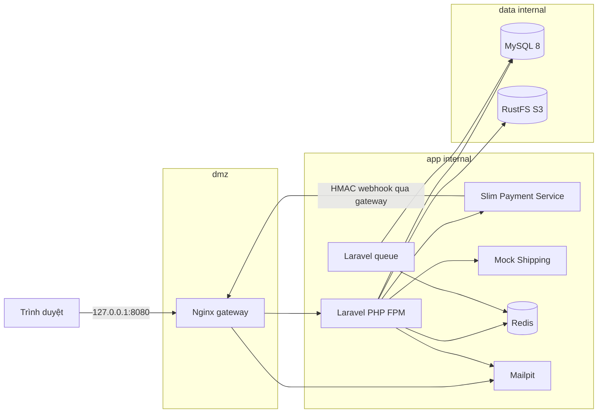

# Kiến trúc Hugo Shop

Hugo Shop chạy local bằng Docker Compose. Chỉ container Nginx publish `127.0.0.1:8080`; mọi dịch vụ còn lại chỉ có địa chỉ nội bộ.

## Ma trận kết nối

| Nguồn | Đích | Mục đích |
| --- | --- | --- |
| Máy host | Nginx | Giao diện, REST API, Mailpit proxy |
| Nginx | Shop PHP FPM | Storefront, admin, `/api/v1` |
| Nginx | Mailpit | Xem email tại `/mailpit/` |
| Shop | MySQL | Dữ liệu nghiệp vụ |
| Shop | Redis | Session, cache, queue |
| Shop | RustFS | Ảnh sản phẩm qua API tương thích S3 |
| Shop | Payment Service | Tokenize, charge, refund |
| Shop | Mock Shipping | Báo giá và vận đơn |
| Payment Service | Nginx | Webhook có chữ ký HMAC |

Payment Service và Mock Shipping không thuộc network `dmz`, không publish cổng và không thể được gọi trực tiếp từ máy host. MySQL và RustFS chỉ thuộc `data`. Redis chỉ thuộc `app`. Shop nối đồng thời `app` và `data` vì đây là thành phần duy nhất cần truy cập cả nghiệp vụ lẫn lưu trữ.

RustFS vẫn hoàn toàn nội bộ. Khi Staff tải ảnh sản phẩm, Shop lưu object key rồi phục vụ ảnh qua route `/media/products/...`; trình duyệt không nhận URL nội bộ hoặc credential S3. Service `storage-init` tạo bucket `products` một lần trước khi PHP-FPM được đánh dấu healthy.

## Biên bảo mật

Nginx thêm các header phòng thủ cơ bản và từ chối dotfiles. Form web dùng CSRF middleware mặc định của Laravel. API tài khoản dùng Sanctum token. Webhook thanh toán xác thực HMAC trên raw body. RBAC được thực thi ở middleware, Gate và Policy; không dựa vào việc ẩn nút trong giao diện.
