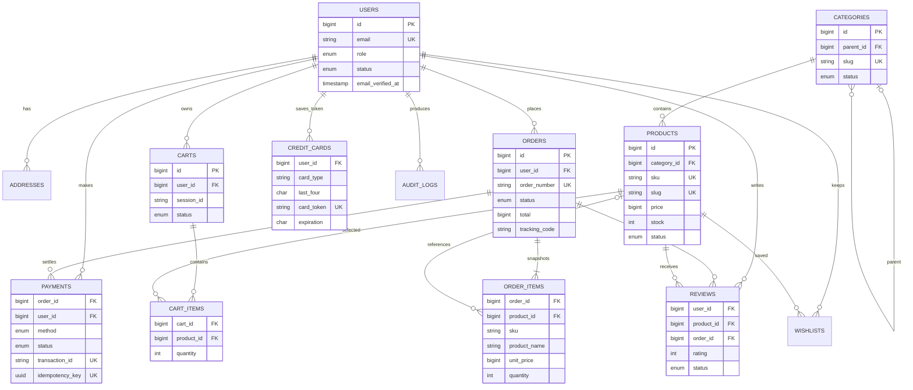

# Sơ đồ dữ liệu

```mermaid
erDiagram
    USERS ||--o{ ADDRESSES : has
    USERS ||--o{ CARTS : owns
    USERS ||--o{ ORDERS : places
    USERS ||--o{ PAYMENTS : makes
    USERS ||--o{ CREDIT_CARDS : saves_token
    USERS ||--o{ REVIEWS : writes
    USERS ||--o{ WISHLISTS : keeps
    USERS ||--o{ AUDIT_LOGS : produces

    CATEGORIES ||--o{ PRODUCTS : contains
    CATEGORIES o|--o{ CATEGORIES : parent
    CARTS ||--o{ CART_ITEMS : contains
    PRODUCTS ||--o{ CART_ITEMS : selected
    ORDERS ||--|{ ORDER_ITEMS : snapshots
    PRODUCTS o|--o{ ORDER_ITEMS : references
    ORDERS ||--o{ PAYMENTS : settles
    ORDERS ||--o{ REVIEWS : proves_purchase
    PRODUCTS ||--o{ REVIEWS : receives
    PRODUCTS ||--o{ WISHLISTS : saved

    USERS {
        bigint id PK
        string email UK
        enum role
        enum status
        timestamp email_verified_at
    }
    CATEGORIES {
        bigint id PK
        bigint parent_id FK
        string slug UK
        enum status
    }
    PRODUCTS {
        bigint id PK
        bigint category_id FK
        string sku UK
        string slug UK
        bigint price
        int stock
        enum status
    }
    CARTS {
        bigint id PK
        bigint user_id FK
        string session_id
        enum status
    }
    CART_ITEMS {
        bigint cart_id FK
        bigint product_id FK
        int quantity
    }
    ORDERS {
        bigint id PK
        bigint user_id FK
        string order_number UK
        enum status
        bigint total
        string tracking_code
    }
    ORDER_ITEMS {
        bigint order_id FK
        bigint product_id FK
        string sku
        string product_name
        bigint unit_price
        int quantity
    }
    PAYMENTS {
        bigint order_id FK
        bigint user_id FK
        enum method
        enum status
        string transaction_id UK
        uuid idempotency_key UK
    }
    CREDIT_CARDS {
        bigint user_id FK
        string card_type
        char last_four
        string card_token UK
        char expiration
    }
    REVIEWS {
        bigint user_id FK
        bigint product_id FK
        bigint order_id FK
        int rating
        enum status
    }
```

Giá dùng số nguyên VND để tránh lỗi dấu phẩy động. `order_items` giữ snapshot tên, SKU và giá tại thời điểm mua. `credit_cards` không có cột PAN đầy đủ hoặc CVV.
