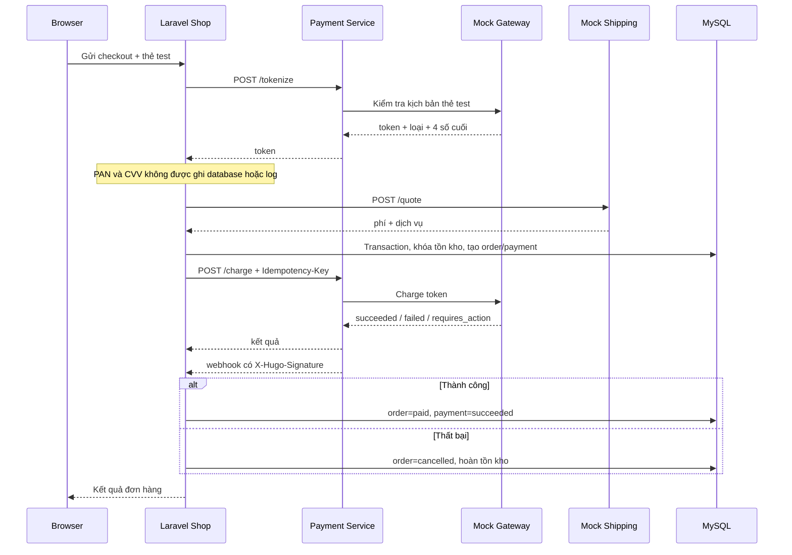

# Luồng thanh toán và vận chuyển

## Thẻ test

| Số thẻ | Kịch bản |
| --- | --- |
| `4242424242424242` | Thành công |
| `4000000000000002` | Bị từ chối |
| `4000000000003220` | Cần xác thực bổ sung |

Dùng hạn `12/30` và CVV `123`. Đây chỉ là dữ liệu giả của mock gateway. Không nhập thẻ thật.

Khách có thể token hóa thêm nhiều thẻ test ở trang tài khoản, chọn một thẻ mặc định hoặc xóa thẻ. Mọi thao tác đều kiểm tra chủ sở hữu. PAN và CVV chỉ tồn tại trong request tới Payment Service; model `CreditCard` chỉ giữ token, loại thẻ, bốn số cuối và hạn thẻ, đồng thời ẩn token khỏi JSON.

Mọi charge bắt buộc có `Idempotency-Key`. Payment Service cache kết quả theo khóa để một retry không tạo giao dịch thứ hai. Webhook ký `HMAC-SHA256(raw_body, PAYMENT_WEBHOOK_SECRET)` và Shop so sánh bằng `hash_equals`.
